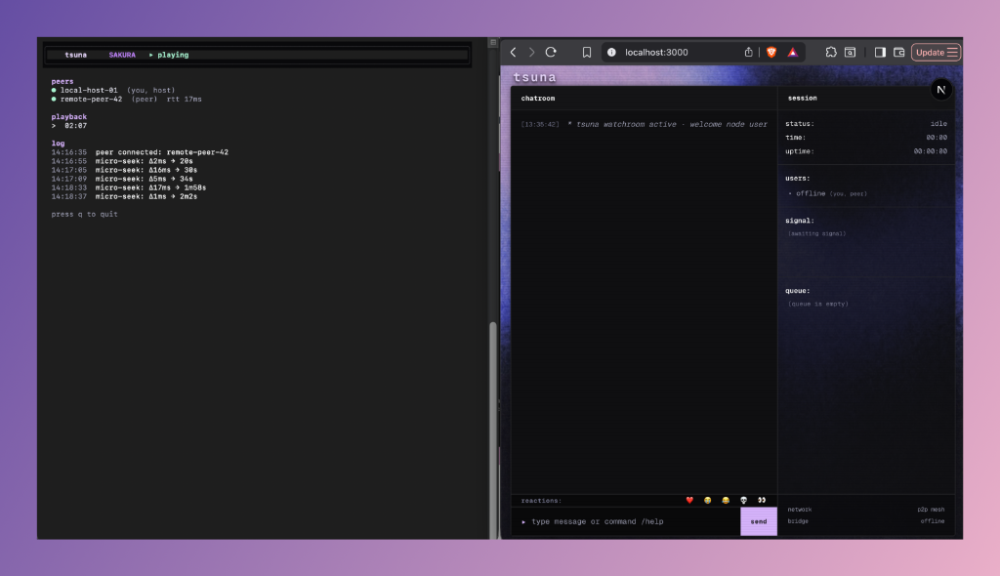
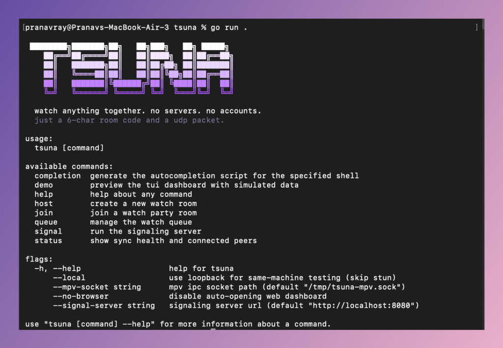
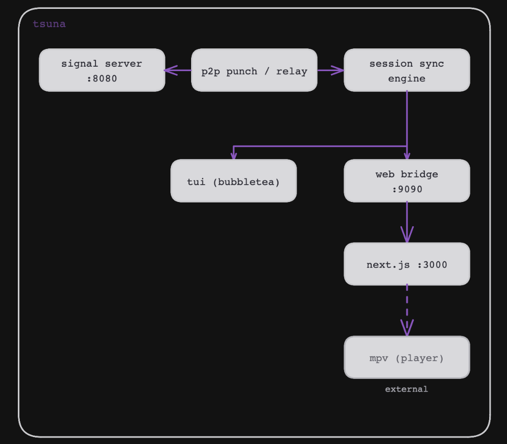

```
 ████████╗███████╗██╗   ██╗███╗   ██╗ █████╗
    ██╔══╝██╔════╝██║   ██║████╗  ██║██╔══██╗
    ██║   ███████╗██║   ██║██╔██╗ ██║███████║
    ██║   ╚════██║██║   ██║██║╚██╗██║██╔══██║
    ██║   ███████║╚██████╔╝██║ ╚████║██║  ██║
    ╚═╝   ╚══════╝ ╚═════╝ ╚═╝  ╚═══╝╚═╝  ╚═╝
```

**watch anything together. no servers. no accounts.**
just a 6-char room code and a udp packet.



---

## what is tsuna?

tsuna is a peer-to-peer synchronized video watching tool. one person hosts a room, gets a short code, and shares it. the other person joins with that code. tsuna punches through nat, establishes a direct udp link between both machines, and keeps both mpv players frame-locked in sync.

no central media server. no accounts. no sign-ups. just two terminals and a room code.

## features

- **p2p nat traversal** - stun discovery + udp hole punching with automatic relay fallback
- **frame-accurate sync** - ntp-style clock synchronization with micro-seek corrections
- **buffering detection** - pauses all peers when one is buffering, resumes together
- **terminal dashboard** - full-screen tui built with bubbletea showing peers, playback, sync telemetry, and logs
- **web dashboard** - browser ui at `localhost:3000` with chatroom, session info, emoji reactions, and slash commands
- **watch queue** - shared queue so you can line up episodes
- **demo mode** - preview the tui with simulated data, no network needed
- **zero config** - works out of the box with sane defaults, optional `~/.tsuna.yaml` for overrides

---

## prerequisites

| tool | version | what for |
|------|---------|----------|
| [go](https://go.dev/dl/) | 1.22+ | building the cli |
| [node.js](https://nodejs.org/) | 18+ | running the web dashboard |
| [mpv](https://mpv.io/) | any recent | the video player tsuna controls |

---

## install

```bash
# clone
git clone https://github.com/pranav718/tsuna.git
cd tsuna

# build the binary
go build -o tsuna .

# install the web dashboard dependencies
cd web && npm install && cd ..
```

or install directly:

```bash
go install github.com/pranav718/tsuna@latest
```



---

## quick start

tsuna connects to a public signal server by default, no setup needed.

### 1. host a room

```bash
./tsuna host
```

tsuna will:
1. discover your public endpoint via stun
2. register with the signal server
3. print a 6-character room code (e.g. `sakura`)
4. wait for peers to join
5. open the tui dashboard and the web dashboard in your browser

### 2. join from another machine

```bash
./tsuna join SAKURA
```

replace `SAKURA` with the code the host got. tsuna will punch through nat (or fall back to relay), connect, and open both dashboards.

### 3. play a video

launch mpv with the ipc socket that tsuna connects to:

```bash
mpv --input-ipc-server=/tmp/tsuna-mpv.sock your-video.mkv
```

both people need to run this with the same video file. once mpv is open and tsuna is connected, everything syncs automatically:

- **pause/unpause** on one side pauses/unpauses the other
- **seeking** on the host side seeks the peer to the same position
- **buffering** is detected automatically and all peers pause until the buffering peer recovers
- **micro-seek corrections** keep drift under a few milliseconds

> **note**: both users need the same video file locally. tsuna syncs playback state, it doesn't stream the video itself. the `--input-ipc-server` path must match your `--mpv-socket` flag (defaults to `/tmp/tsuna-mpv.sock`).

> **web dashboard**: the web ui runs locally. start it with `cd web && npm run dev` before hosting/joining to get the browser dashboard alongside the tui.

---

## commands

| command | description |
|---------|-------------|
| `tsuna` | show banner and help |
| `tsuna signal` | run the signaling server |
| `tsuna host` | create a new watch room |
| `tsuna join <code>` | join an existing room by code |
| `tsuna status` | list all active rooms |
| `tsuna status <code>` | show peers in a specific room |
| `tsuna demo` | preview the tui with fake data |
| `tsuna queue add <file>` | add a file to the watch queue |
| `tsuna queue list` | show the current queue |

### flags

| flag | default | description |
|------|---------|-------------|
| `--signal-server` | `http://localhost:8080` | signaling server url |
| `--mpv-socket` | `/tmp/tsuna-mpv.sock` | mpv ipc socket path |
| `--local` | `false` | use loopback for same-machine testing (skips stun) |
| `--no-browser` | `false` | don't auto-open the web dashboard |

the signal server also takes:

| flag | default | description |
|------|---------|-------------|
| `-p, --port` | `8080` | port to listen on |

---

## web dashboard

once connected, the web dashboard at `localhost:3000` gives you:

- **chatroom** - send messages to peers in the room
- **session sidebar** - live status, playback time, uptime, sync delta, peer list, signal log, queue
- **emoji reactions** - floating reactions that appear on screen
- **slash commands**:

| command | what it does |
|---------|-------------|
| `/help` | list all commands |
| `/me <action>` | show an action to peers |
| `/react <emoji>` | trigger a screen reaction |
| `/status` | show node and sync telemetry |
| `/whois` | display your node id |
| `/clear` | clear the chat log |

---

## configuration

tsuna looks for `~/.tsuna.yaml` on startup. all fields are optional.

```yaml
signal_server: "http://localhost:8080"
mpv_socket: "/tmp/tsuna-mpv.sock"
display_name: ""
local_mode: false
```

command-line flags override config file values.

---

## architecture



### how it works

1. **signaling** - the signal server is a tiny http service that maps room codes to peer addresses. peers register with their public ip:port and poll for other peers in the same room.

2. **nat traversal** - each peer discovers its public endpoint via stun (`stun.l.google.com:19302`). when two peers know each other's addresses, they do simultaneous udp hole punching to establish a direct connection. if punching fails (symmetric nat, etc.), they fall back to relaying through the signal server's websocket.

3. **clock sync** - once connected, peers run an ntp-style clock synchronization protocol. they exchange timestamps, compute round-trip time and clock offset, and use that to keep playback positions aligned within milliseconds.

4. **corrections** - the session engine continuously monitors sync drift. if the delta exceeds a threshold, it issues a micro-seek correction to the lagging player. if one peer is buffering, all peers pause until it recovers.

5. **dual interface** - events flow from the session engine into both the terminal tui (via bubbletea) and the web dashboard (via a websocket bridge on `:9090` that the next.js frontend connects to).

---

## local development

for testing on a single machine, use the `--local` flag which skips stun and uses `127.0.0.1`. this runs a local signal server instead of the public one.

open four terminals:

```bash
# terminal 1: signal server (local)
cd ~/tsuna && go run . signal

# terminal 2: web dashboard
cd ~/tsuna/web && npm run dev

# terminal 3: host
cd ~/tsuna && go run . host --local --signal-server http://localhost:8080

# terminal 4: join (use the code from terminal 3)
cd ~/tsuna && go run . join XXXXXX --local --signal-server http://localhost:8080
```

or just preview the tui without any networking:

```bash
go run . demo
```

---

## self-hosting

tsuna uses a public signal server by default (`https://tsuna-production.up.railway.app`). if you want to run your own:

```bash
# run the signal server
./tsuna signal --port 8080

# point clients to your server
./tsuna host --signal-server http://your-server:8080
./tsuna join SAKURA --signal-server http://your-server:8080
```

the signal server is a lightweight go http service (~270 lines) with zero external dependencies. it only handles room code lookup and websocket relay. no media ever flows through it.

you can also deploy it with docker:

```bash
docker build -t tsuna-signal .
docker run -p 8080:8080 tsuna-signal
```

## project structure

```
tsuna/
├── main.go                 # entry point
├── cmd/                    # cobra commands
│   ├── root.go             # root command, banner, flags
│   ├── host.go             # host a room
│   ├── join.go             # join a room
│   ├── signal.go           # run signal server
│   ├── status.go           # show room status
│   ├── demo.go             # tui demo mode
│   ├── queue.go            # watch queue commands
│   └── styles.go           # cli output styling
├── internal/
│   ├── config/             # yaml config loader
│   ├── mpv/                # mpv ipc control
│   ├── p2p/                # stun, hole punching, relay
│   ├── room/               # room code generation
│   ├── session/            # sync engine
│   ├── signal/             # signal server + client
│   ├── sync/               # clock sync protocol
│   ├── tui/                # bubbletea terminal ui
│   ├── queue/              # shared watch queue
│   └── web/                # websocket bridge
├── web/                    # next.js frontend
│   ├── src/
│   │   ├── app/            # pages, layout, global css
│   │   ├── components/     # chatpanel, sessionsidebar, queuepanel
│   │   └── hooks/          # usetsunaSocket websocket hook
│   └── public/             # static assets
├── go.mod
└── go.sum
```

---

## tech stack

| layer | tech |
|-------|------|
| cli framework | [cobra](https://github.com/spf13/cobra) |
| terminal ui | [bubbletea](https://github.com/charmbracelet/bubbletea) + [lipgloss](https://github.com/charmbracelet/lipgloss) |
| web frontend | [next.js](https://nextjs.org/) 16 + react 19 + tailwindcss 4 |
| websockets | [gorilla/websocket](https://github.com/gorilla/websocket) |
| video player | [mpv](https://mpv.io/) via ipc socket |
| nat traversal | stun + udp hole punching |
| config | yaml via `~/.tsuna.yaml` |

---

<sub>built by [@pranav718](https://github.com/pranav718)</sub>
